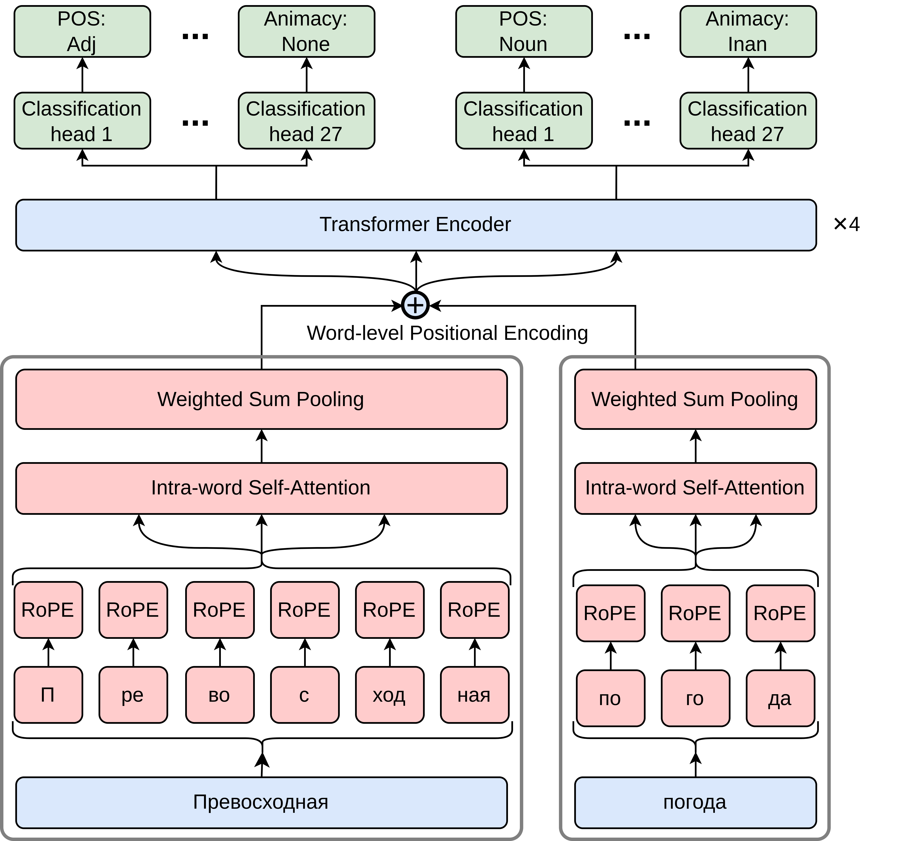

# MorphTagger

MorphTagger - модель морфологического классификатора на основе модифицированного энкодера трансформера. Фундаментальной идеей архитектуры является аггрегация токенов слова при помощи механизма внимания и сети-эксперта. Итоговая модель позволяет производить морфологический разбор слов на **русском языке** с высокой точностью, при этом обеспечивает молниеносную скорость обработки и низкий расход памяти.\
Статья с подробным описанием архитектуры: [arxiv.org](https://arxiv.org/abs/2604.02926)

## Архитектура модели

<p align="center">
  
</p>

## Структура репозитория

```
morph_tagger/
├── morph_tagger/                   # основной Python-пакет
│   ├── model/                      # архитектура модели
│   │   ├── model.py                # MHAModel + EncoderBlock
│   │   └── positional_encoding.py  # RoPE, Learnable, Sinusoidal
│   ├── core/                       # базовые компоненты
│   │   ├── vocabulary.py           # Vocabulary — словарь токен-индекс
│   │   ├── tokenizer.py            # BPETokenizer, SeparatorTokenizer
│   │   ├── vectorizer.py           # Vectorizer — токены/слова → индексы
│   │   └── dataset.py              # CustomDataset — датасет для DataLoader
│   └── preprocessing/              # подготовка датасетов
│       ├── create.py               # распаковка .conllu в .parquet
│       └── vectorize.py            # токенизация + векторизация
├── cli/                            # CLI-скрипты
│   ├── train.py                    # обучение модели
│   ├── test.py                     # тестирование на одном предложении
│   ├── validate.py                 # тестирование метрик на датасете
│   └── utils.py                    # общие функции для train/validate
├── checkpoints/                    # веса модели и конфиг токенизатора
│   ├── final_tokens_model_params.pt
│   ├── tokenizer.json
│   └── tokens_model_hyperparams.json
├── data/                           # словари, метрики, конфиги
├── dataset/                        # подготовленные .parquet датасеты
```

## Установка

```bash
pip install -r requirements.txt
```

## Использование

### Тестирование на одном предложении

```bash
python -m cli.test "Мама мыла раму" --device cpu --morpheme "upos Animacy"
```

### Обучение модели

```bash
python -m cli.train --dataset merged --batch 64 --device cuda --checkpoint_epoch 5
```

Для дообучения флаг `--pretrained`.

### Тестирование метрик на датасете

```bash
python -m cli.validate --dataset syntagrus --split test --batch 256 --device cuda
```

### Подготовка датасетов

Последовательность шагов для подготовки данных.

**CLI:**

```bash
# 1. Распаковка .conllu в .parquet
python -m morph_tagger.preprocessing.create --dataset syntagrus

# 2. Токенизация + векторизация
python -m morph_tagger.preprocessing.vectorize --dataset merged --mfp 800
python -m morph_tagger.preprocessing.vectorize --dataset syntagrus --pretrained
```

**Программно:**

```python
from morph_tagger.preprocessing.create import DatasetCreator
from morph_tagger.preprocessing.vectorize import DatasetPreprocessor

# Шаг 1: распаковка .conllu в .parquet
creator = DatasetCreator(syntagrus_version='2.16')
creator.run('merged')

# Шаг 2: токенизация + векторизация
preproc = DatasetPreprocessor(mfp=800)
config = preproc.run('syntagrus', pretrained=True)

# config содержит:
# {'max_words_count': 22,
#  'max_subtokens_count': 4,
#  'source_vocab_len': 2685, ...}
```

### Аргументы командной строки

#### `train.py`

| Аргумент | Описание | По умолчанию |
|---|---|---|
| `--dataset` | `taiga`, `syntagrus` или `merged` | `merged` |
| `--pretrained` | Использовать предобученную модель | - |
| `--epochs` | Количество эпох | `35` |
| `--batch` | Размер батча | `96` |
| `--device` | `cpu` или `cuda` | `cuda` |
| `--checkpoint_epoch` | Интервал сохранения (эпохи) | `2` |

#### `test.py`

| Аргумент | Описание | По умолчанию |
|---|---|---|
| `user_query` | Предложение для анализа | - |
| `--morpheme` | Морфемы для вывода через пробел | все |
| `--device` | `cpu` или `cuda` | `cuda` |

Доступные морфемы: `upos`, `head`, `deprel`, `Mood`, `NumType`, `VerbForm`, `ExtPos`, `Reflex`, `Polarity`, `Typo`, `NameType`, `InflClass`, `Person`, `Poss`, `Animacy`, `Degree`, `Foreign`, `Variant`, `Number`, `Gender`, `NumForm`, `Aspect`, `Case`, `PronType`, `Tense`, `Abbr`, `Voice`

#### `validate.py`

| Аргумент | Описание | По умолчанию |
|---|---|---|
| `--dataset` | `taiga`, `syntagrus` или `merged` | `merged` |
| `--split` | `validation` или `test` | `validation` |
| `--batch` | Размер батча | `64` |
| `--device` | `cpu` или `cuda` | `cuda` |

#### `create.py` (preprocessing)

| Аргумент | Описание | По умолчанию |
|---|---|---|
| `--dataset` | `taiga`, `syntagrus` или `merged` | `merged` |
| `--syntagrus-version` | Версия Syntagrus | из `.env` |

#### `vectorize.py` (preprocessing)

| Аргумент | Описание | По умолчанию |
|---|---|---|
| `--dataset` | `taiga`, `syntagrus` или `merged` | `merged` |
| `--pretrained` | Использовать предобученный токенизатор | - |
| `--mfp` | Мин. частота для слияния символов | `800` |
| `--exclude-unused-grammemes` | Исключить не принадлежащие слову граммемы | - |
| `--quantile` | Квантиль для MAX_SUBTOKENS_COUNT | `0.98` |